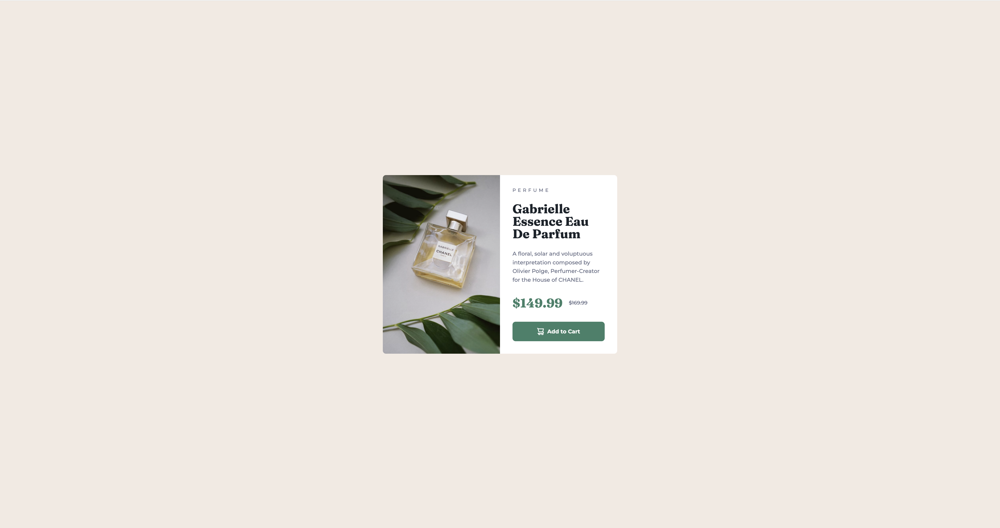

# Social Links Profile

A mobile-first, responsive product preview card component built with HTML and CSS. It features art-directed image, a flexible flexbox layout, and scalable, accessible typography.
## Screenshots



## Demo

[View Live Project](https://5-product-preview-card-component.vercel.app/)

## Project Structure

```
/recipe-page
├── assets/
│   ├── images/
│   ├── preview/
├── index.html
├── styles.css
├── README.md
```

## Technologies Used

- HTML5
- CSS3

## Installation & Usage

To run the project locally:

1. Clone the repository:
   ```sh
   git clone https://github.com/austin-jonas/5-product-preview-card-component.git
   ```
2. Open index.html in a browser.